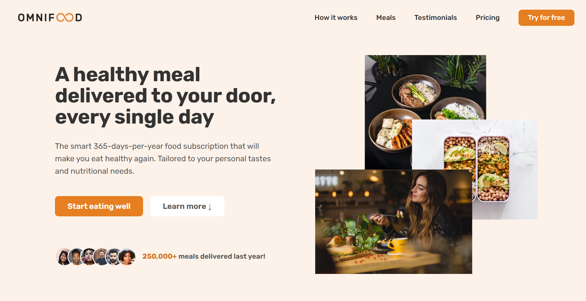
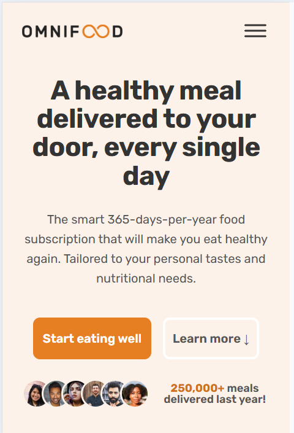

# 🍽️ Omnifood

A modern and fully responsive food delivery landing page designed to showcase a premium AI-powered meal subscription service.

Omnifood focuses on clean design, smooth user experience, and modern web development practices to create a professional marketing website that looks great on all devices.

## 🚀 Live Demo

**Try it here:** https://omnifoodbymehdi.netlify.app/

---

## 📸 Preview

### Hero Section

```md

```

### Responsive Design

```md

```

---

## ✨ Features

* 🍽️ Modern food delivery landing page
* 📱 Fully responsive design
* ⚡ Fast-loading and optimized performance
* 🎨 Clean and professional UI
* 🖼️ High-quality visual presentation
* 🧭 Smooth navigation experience
* 📋 Pricing and subscription plans
* ⭐ Customer testimonials section
* 📞 Contact and call-to-action sections

---

## 🛠️ Built With

* HTML5
* CSS3
* JavaScript (ES6+)
* Responsive Web Design
* Flexbox
* CSS Grid

---

## 📂 Project Structure

```text
omnifood/
│
├── css/
├── js/
├── img/
├── content/
│
├── index.html
└── README.md
```

---

## ⚙️ Installation

Clone the repository:

```bash
git clone https://github.com/MehdySadeghi/Omnifood.git
```

Navigate to the project folder:

```bash
cd Omnifood
```

Open the project:

```text
index.html
```

For the best development experience, use VS Code Live Server.

---

## 🎓 What I Learned

This project helped me strengthen my understanding of:

* Responsive web design principles
* Modern CSS techniques
* CSS Grid and Flexbox layouts
* Building production-quality landing pages
* Website performance optimization
* Creating accessible user interfaces
* Mobile-first development
* Professional UI/UX design practices

---

## 🔮 Future Improvements

Planned enhancements include:

* Dark mode support
* Multi-language support
* Interactive pricing calculator
* Enhanced animations and transitions
* Backend integration for subscriptions
* User authentication
* Newsletter management system
* Advanced accessibility improvements

---

## 🤝 Contributing

Contributions, suggestions, and feedback are welcome.

Feel free to fork the repository and submit a pull request.

---

## 📄 License

This project is open source and available under the MIT License.

---

## 👨‍💻 Author

### Mehdy Sadeghi

Passionate Front-End Developer focused on building modern, responsive, and user-friendly web applications.

GitHub:
https://github.com/MehdySadeghi

Repository:
https://github.com/MehdySadeghi/Omnifood

---

### ⭐ If you found this project useful, consider giving it a star.
